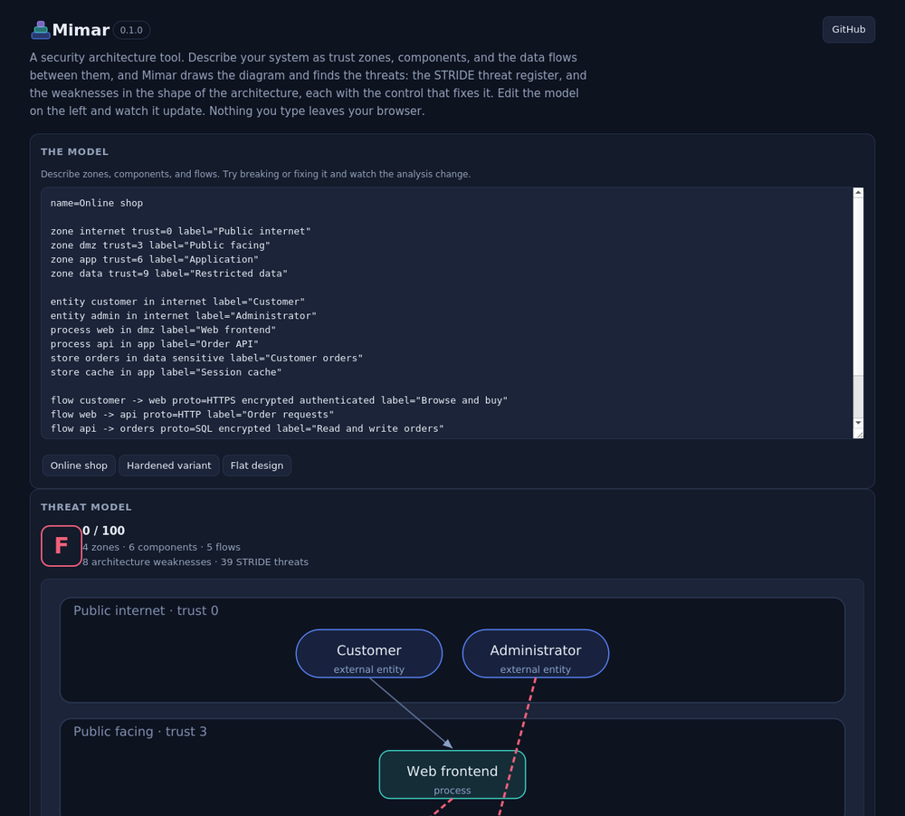

# Mimar

**A security architecture tool.** Describe your system as trust zones, components, and the data flows between them, and Mimar draws the diagram and finds the threats: a STRIDE threat register for every component and flow, and the weaknesses in the shape of the architecture itself, each with the control that fixes it. It runs at design time, before anything is built, and it has zero dependencies.

Mimar is the Arabic word for architect.

### Try it in your browser

**[siteq8.github.io/Mimar](https://siteq8.github.io/Mimar/)**

Edit the model on the left and watch the diagram, the score, the weaknesses, and the threat register update as you type. Nothing you enter leaves your browser.



## The idea

Most security problems in a system are decided at design time. A database that the public tier can reach directly. An admin path that skips the application logic. A flow that crosses a trust boundary in the clear. You cannot patch your way out of a weak structure, and by the time the code exists the structure is expensive to change.

Threat modeling is the practice of catching these before they are built, but it is often a whiteboard session that fades. Mimar turns the model into a short text file you can keep in the repository, review in a pull request, and run. Give it the architecture and it gives you back three things.

**The diagram.** Trust zones as bands ordered by how trusted they are, components placed inside them, and the data flows drawn as arrows. A flow that is part of a weakness is drawn in red, and a flow that is not encrypted is dashed, so the weak paths stand out on sight.

**The STRIDE threat register.** For every component and every flow, the threats that apply to it, using the standard STRIDE mapping, each with a concrete first mitigation. Spoofing, Tampering, Repudiation, Information disclosure, Denial of service, and Elevation of privilege.

**The architecture weaknesses.** This is the part a plain checklist misses. Mimar looks at how the parts are arranged and flags the mistakes that matter most, each with the exact control that fixes it and a grade for the whole design.

## The model language

A model is a short text file. Every line is one statement, and anything after a hash is a comment.

```
name=Online shop

zone internet trust=0 label="Public internet"
zone dmz trust=3 label="Public facing"
zone app trust=6 label="Application"
zone data trust=9 label="Restricted data"

entity customer in internet label="Customer"
entity admin in internet label="Administrator"
process web in dmz label="Web frontend"
process api in app label="Order API"
store orders in data sensitive label="Customer orders"

flow customer -> web proto=HTTPS encrypted authenticated label="Browse and buy"
flow web -> api proto=HTTP label="Order requests"
flow api -> orders proto=SQL encrypted label="Read and write orders"
flow admin -> orders proto=SQL label="Direct admin queries"
```

A **zone** is a trust boundary with a trust level, where zero is fully untrusted ground and higher numbers are more trusted. A component is an **entity** (an external actor such as a user or a third party), a **process** (a service that does work), or a **store** (where data rests, marked `sensitive` when it holds data that matters). A **flow** is a directed connection that carries data, with optional `encrypted` and `authenticated` flags and a protocol.

That is the whole language. It reads close to plain notes on purpose.

## What a weak design looks like

The model above has a problem hiding in the last line. The administrator, sitting on the public internet, queries the sensitive orders store directly, in the clear, skipping every tier in between. Run it and Mimar says so:

```
$ mimar analyze examples/shop.mimar

Mimar threat model: Online shop
  score 0/100  grade F
  4 zones, 6 components, 5 flows
  8 architecture weaknesses, 39 STRIDE threats

Architecture weaknesses  (most serious first)
  [CRITICAL] Sensitive data store reachable from an untrusted zone
      The store Customer orders holds sensitive data, yet Administrator in an
      untrusted zone can reach it directly. One compromised entry point then
      reaches the data.
      control: Place the store behind an application tier that mediates every
      access, and never expose it to the untrusted zone.
  [HIGH] External entity has direct data store access
      ...
  [HIGH] Cleartext flow crosses a trust boundary
      ...
```

The hardened variant in `examples/shop-hardened.mimar` routes the admin through an admin portal in the application tier and encrypts and authenticates every flow. Same system, sound structure, and it scores a hundred with no weaknesses. Running the two side by side is the quickest way to see what Mimar is looking for.

## The weaknesses it checks

Mimar flags a sensitive store an untrusted zone can reach, an external entity wired straight to a data store, the most trusted zone sitting one hop from untrusted ground, cleartext crossing a trust boundary, an unauthenticated flow entering a more trusted zone, a sensitive data flow left unencrypted, a sensitive store placed in a low trust zone, a flat design with everything in one zone and no segmentation, and an external entity sharing a zone with a data store. Each finding names the parts involved and the control that resolves it.

## Install and use

Mimar needs Python 3.9 or newer and nothing else.

```
pip install https://github.com/SiteQ8/Mimar/releases/download/v0.1.0/mimar-0.1.0-py3-none-any.whl
```

Or clone and run it in place:

```
git clone https://github.com/SiteQ8/Mimar.git
cd Mimar
python3 -m mimar analyze examples/shop.mimar
```

Commands:

```
mimar analyze <file>              analyze a model and print its threat model
mimar analyze <file> --format json|markdown|html --output report.html
mimar example                     print a model to start from
mimar serve                       open the browser version locally
mimar version
```

`analyze` exits non zero when it finds a critical or high weakness, so it drops into a pipeline or a pre commit check without extra wiring.

## Honest scope

Mimar is a thinking aid, not an oracle. STRIDE is a structured checklist, thorough for what it covers but not a proof that you have found every threat. The architecture checks are opinionated heuristics that encode common and serious design mistakes; they will not catch a subtle logic flaw, and on an unusual design they may flag something you have accepted on purpose. The model is only as good as the picture you give it, and it reasons about the design you describe, not the running system. Use it to find the obvious structural problems early and cheaply, and to keep a threat model that lives in the repository next to the thing it describes. It does not replace a careful review by people who know the system.

Mimar is defensive throughout. It helps you design and inspect an architecture. It does not attack anything.

## License

MIT. See [LICENSE](LICENSE).
